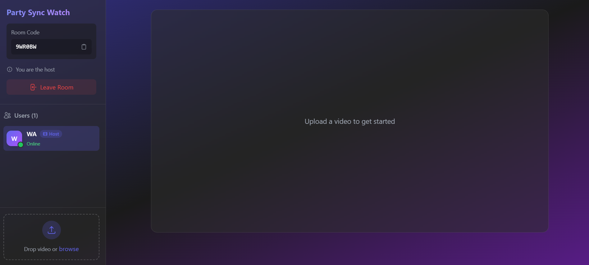

# 🎥 Party Sync Watch

watch videos together with ur friends in perfect sync! built with next.js, express and socket.io

## 🚀 demo
check it out live: [party-sync-watch.onrender.com](https://party-sync-watch.onrender.com/)

## 📸 screenshots

*home page with join/create options*


*create a new room and become the host*


*watch videos together with real-time sync*

## 🚀 features
- create rooms and invite friends
- upload videos and watch em together
- everything syncs perfectly
- modern ui with tailwind
- host controls with fancy progress bar
- volume control for everyone
- fullscreen support for mobile/desktop
- upload progress tracking with speed and size info
  > note: when uploading, it might take a few minutes (based on the size of the video) to start showing progress (be patient)
- drag n drop video uploads

## 🛠️ tech stack
- next.js 13
- tailwind css
- express
- socket.io
- framer motion

## 💻 getting started

ok so first clone this:
```bash
git clone https://github.com/wa0101/Party-Sync-Watch
cd party-sync-watch
```

install the dependencies:
```bash
npm install
# or
yarn install
# or
pnpm install
```

run this in dev mode:
```bash
npm run dev
```

now open [http://localhost:3000](http://localhost:3000)

## 🚀 deployment on render.com

1. fork this repo to ur github

2. create a new web service on render:
   - connect to ur github repo


3. use these settings:
   - Build Command: `npm install && npm run build`
   - Start Command: `npm start`

4. add these environment variables:
   ```
   NODE_ENV=production
   NEXT_PUBLIC_SOCKET_URL=https://your-app-url.onrender.com
   RENDER_EXTERNAL_URL=https://your-app-url.onrender.com
   ```
   (replace `your-app-url` with ur actual render url)

5. click deploy and grab a coffee ☕
   - it might take a few mins
   - if it fails, check the logs
   - make sure all env vars are set

6. once its done, ur app will be live at:
   `https://your-app-name.onrender.com`

## 📝 todo list (maybe someday lol)
- [ ] switch to cloud storage (render storage kinda sucks rn)
  - aws s3 or cloudflare r2 for better reliability
  - faster upload speeds
  - no storage limits to worry about
  - better cdn for faster video loading
  - maybe add resumable uploads
- [ ] add chat system


## ⚠️ known issues
- sometimes the sync gets weird


---
